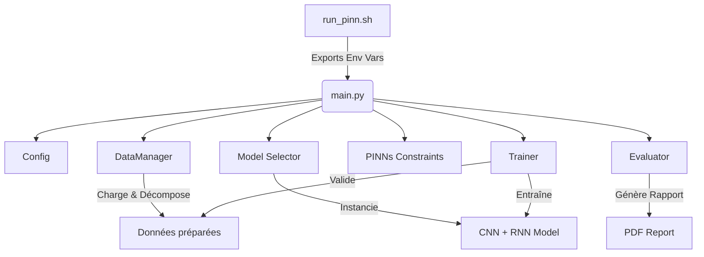

# Documentation du Dossier Model

Ce dossier contient l'implémentation des modèles de prédiction basés sur les Réseaux de Neurones Informés par la Physique (PINNs) pour le projet CEGEPSI.

## Procédure de Lancement

Le script principal pour lancer l'entraînement et l'évaluation est `run_pinn.sh`. Il automatise la configuration de l'environnement et l'exécution de `main.py`.

### Utilisation
```bash
bash run_pinn.sh [RNN_TYPE] [USE_CNN] [DECOMPOSITION_METHOD]
```

### Paramètres
- **RNN_TYPE** : Type de réseau récurrent (`GRU` ou `LSTM`). *Défaut : GRU*.
- **USE_CNN** : Activer ou désactiver l'extracteur de caractéristiques CNN (`true` ou `false`). *Défaut : true*.
- **DECOMPOSITION_METHOD** : Méthode de décomposition du signal (`VMD`, `CEEMDAN`, `SSA` ou `false`). *Défaut : VMD*.

### Exemples
```bash
# Lancement par défaut (CNN-GRU avec VMD)
bash run_pinn.sh

# Lancement d'un LSTM simple sans décomposition
bash run_pinn.sh LSTM false false
```

---

## Description des Fichiers

| Fichier | Rôle |
| :--- | :--- |
| `run_pinn.sh` | Point d'entrée utilisateur. Gère le venv et les variables d'environnement. |
| `main.py` | Orchestrateur principal : coordination des données, du modèle et de l'entraînement. |
| `config.py` | Centralisation de tous les paramètres (hyperparamètres, colonnes, chemins). |
| `data_manager.py` | Gestionnaire du cycle de vie des données (chargement, décomposition, scaling). |
| `model.py` | Définitions des architectures globales (regroupant CNN et RNN). |
| `CNN.py` | Architecture spécifique de la couche de convolution. |
| `pinns.py` | Implémentation des fonctions de perte physiques (contraintes de domaine). |
| `trainer.py` | Logique de la boucle d'entraînement et de validation. |
| `evaluator.py` | Calcul des métriques de performance et gestion de l'évaluation finale. |
| `pdf_utils.py` | Génération automatisée du rapport de résultats au format PDF. |
| `data_utils.py` | Fonctions utilitaires diverses pour la manipulation des données. |

---

## Chaîne d'Exécution

Voici comment les composants interagissent lors d'un lancement standard :



1. **Initialisation** : `run_pinn.sh` prépare l'environnement et lance `main.py`.
2. **Configuration & Données** : `main.py` charge la configuration et appelle `DataManager` pour transformer les données brutes en séquences normalisées (avec décomposition optionnelle).
3. **Construction du Modèle** : Le modèle est assemblé (avec ou sans CNN) et les contraintes physiques (PINNs) sont définies selon les cibles.
4. **Apprentissage** : Le `Trainer` optimise les poids du réseau en minimisant une perte hybride (Erreur Quadratique + Perte PINN).
5. **Restitution** : L'`Evaluator` produit les prédictions finales et délègue à `pdf_utils` la création d'un rapport visuel détaillé.
